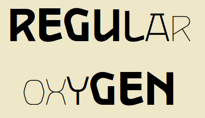

# [Variable font playground](https://oskar-anderson.github.io/Kapsas/)

Playground for regular and variable font animation.




Live: https://oskar-anderson.github.io/Kapsas/


# Used Libraries:

* https://splitting.js.org (animation)
* https://highlightjs.org/ (client side css and js highlighing)
* https://getbootstrap.com (element collapse)

# Running locally:

CORS prevents the use ES6 modules over the `file://` protocol, so you cannot just run the project by opening the `index.html` file. The project has to run as a server.

## Option 1: use Python http.server

open project directory in terminal

```
python pyServer.py 
```
Or
```
python3 pyServer.py
```

## Option 2: Firefox

Enter URL `about:config` and set value `
security.fileuri.strict_origin_policy = false
`

Reload the browser.

# Extra

Good articles:

* https://css-tricks.com/almanac/properties/a/animation/
* https://css-tricks.com/creating-an-editable-textarea-that-supports-syntax-highlighted-code/

https://fontgauntlet.com (interesting)
